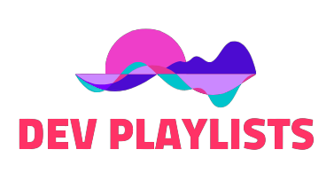

  

> Share your awesome playlists with the World!

## Local Development

- clone this repository using `git clone https://github.com/abdus/dev-playlists.git`.
- `cd dev-playlists`
- `yarn`. a dev-server will be spawned
- `yarn dev`, and open [localhost:3000](http://localhost:3000)
